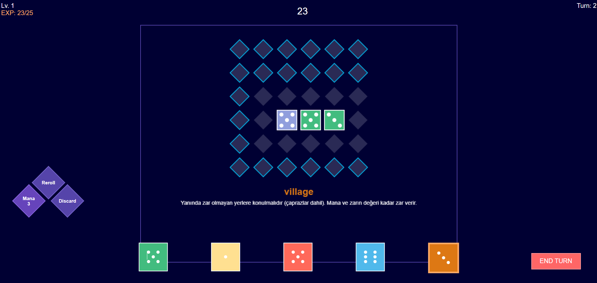
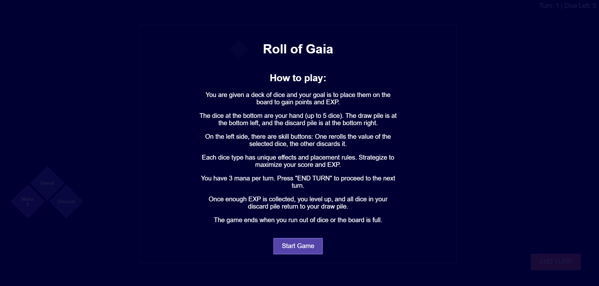
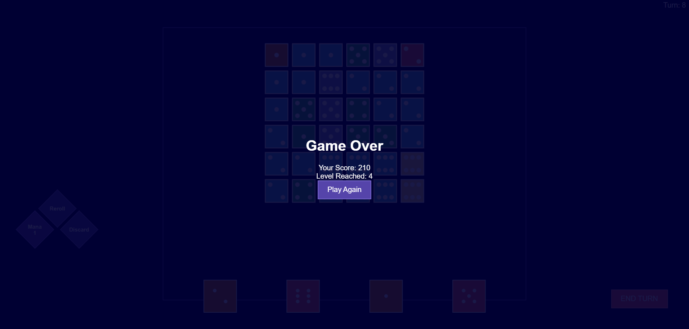

# Roll of Gaia - Strateji Zar Yerleştirme Oyunu

**Roll of Gaia**, HTML5 Canvas ve JavaScript kullanılarak geliştirilmiş, stratejik bir zar yerleştirme oyunudur. Oyuncular, altıgen bir tahtada elementel zarları yerleştirerek kendi diyarlarını inşa eder. Her zar tipi, zorlu taktiksel kararlar yaratan benzersiz yeteneklere ve yerleştirme kurallarına sahiptir.

Bu README dosyası, oyunun nasıl çalıştığını, kurulum adımlarını, oynanış mekaniklerini ve geliştirme sürecinde kullanılan teknolojileri detaylı bir şekilde açıklamaktadır. Oyun, şans ve stratejiyi birleştirerek oyunculara zengin bir deneyim sunar.

## 🎮 Oyuna Hızlı Bakış



## İçindekiler
- [Oyun Hakkında](#oyun-hakkında)
- [Oynanış Mekanikleri](#oynanış-mekanikleri)
- [Zar Türleri ve Yetenekleri](#zar-türleri-ve-yetenekleri)
- [Strateji İpuçları](#strateji-ipuçları)
- [Kontroller](#kontroller)
- [İlerleme Sistemi](#ilerleme-sistemi)
- [Kurulum ve Çalıştırma](#kurulum-ve-çalıştırma)
- [Oynanış Videosu](#oynanış-videosu)
- [Ekran Görüntüleri](#ekran-görüntüleri)
- [Ses Özellikleri](#ses-özellikleri)
- [Teknik Detaylar](#teknik-detaylar)
- [Görsel Tasarım](#görsel-tasarım)
- [Kullanılan Teknolojiler](#kullanılan-teknolojiler)
- [Geliştirme Notları](#geliştirme-notları)
- [Katkıda Bulunma](#katkıda-bulunma)
- [Kullanılan Kaynaklar](#kullanılan-kaynaklar)
- [Lisans](#lisans)

## Oyun Hakkında

**Roll of Gaia**, oyuncuların altıgen bir tahta üzerinde elementel zarları stratejik olarak yerleştirerek puan kazandığı ve deneyim topladığı bir strateji oyunudur. Oyunun temel amacı, her zar tipinin benzersiz özelliklerini kullanarak mümkün olan en yüksek puanı elde etmek ve seviye atlayarak daha gelişmiş zar türlerine erişim sağlamaktır.

Oyun, zarların şansını stratejik yerleştirme kararlarıyla birleştirerek hem yeni başlayanlar hem de deneyimli strateji oyuncuları için meydan okuyucu bir deneyim sunar. Her oyun, farklı zar kombinasyonları ve tahta durumları nedeniyle benzersiz bir mücadele yaratır.

## Oynanış Mekanikleri

### Temel Oynanış
- Her tur başında 5 zar ve 3 mana ile başlarsınız
- Zarları altıgen tahtaya yerleştirerek puan kazanır ve deneyim toplar
- Her yerleştirme 1 mana maliyeti vardır
- Elinizi stratejik olarak yönetmek için beceri aksiyonları (Yeniden At/At) kullanın
- Mananızı yenilemek ve yeni zarlar çekmek için turunuzu bitirin
- Çöp yığınınızı geri dönüştürmek için yeterli deneyim kazanarak seviye atlayın

### Oyun Sonu
Oyun şu durumlarda sona erer:
- Tahta tamamen zarlarla doldurulduğunda
- Çekilecek zar kalmadığında

Son puanınız, zar yerleştirmelerinden ve özel efektlerinden kazanılan puanlara dayanır.

## Zar Türleri ve Yetenekleri

### 🔥 FIRE DICE
- **Yerleştirme:** Tahtanın herhangi bir yerine yerleştirilebilir
- **Etki:** Değerine göre düz çizgilerde zarlar üzerinde hasar verir
- **Strateji:** İstenmeyen zarları temizlemek ve yok edilen hedeflerden bonus puan kazanmak için kullanın

### 💧 LAKE DICE
- **Yerleştirme:** Mevcut zarların yanına yerleştirilmeli (dik komşu)
- **Etki:** Tüm boş komşu hücrelere yayılır (çaprazlar dahil)
- **Strateji:** Büyük bağlantılı alanlar yaratır ve çiftlik yerleştirmesini mümkün kılar

### 🌲 FOREST DICE
- **Yerleştirme:** Mevcut zarların yanına yerleştirilmeli (dik komşu)
- **Etki:** Tüm komşu zar değerlerinin toplamı kadar puan kazanır
- **Strateji:** Maksimum fayda için yüksek değerli zar kümelerinin yakınına yerleştirin

### 🏘️ VILLAGE DICE
- **Yerleştirme:** İzole alanlara yerleştirilmeli (çaprazlar dahil komşu zar olmamalı)
- **Etki:** Zar değeri kadar mana ve kart verir
- **Strateji:** Kaynak yönetimi ve el doldurma için gereklidir

### 🌾 FARM DICE
- **Yerleştirme:** Göl zarlarının yanına yerleştirilmeli
- **Etki:** Her tur +1 değer büyür (maksimum 6), her büyüme +2 puan verir
- **Strateji:** Zamanla çok değerli hale gelen uzun vadeli yatırım

### ⛰️ MOUNTAIN DICE
- **Yerleştirme:** Tahtanın herhangi bir yerine yerleştirilebilir
- **Etki:** Özel yetenek yok, sadece yüz değeri kadar puan verir
- **Strateji:** Diğer seçenekler mevcut olmadığında güvenilir dolgu zarı
- 
## Kontroller

### Fare Kontrolleri
- **Sol Tık (Zar Üzerinde):** Elinizden zar seç/seçimi kaldır
- **Sol Tık (Tahta Üzerinde):** Seçili zarı geçerli hücrelere yerleştir
- **Üzerine Gelme:** Geçerli yerleştirme konumlarını önizle

### Aksiyon Butonları
- **Yeniden At:** Seçili zarların değerini değiştir (1 mana maliyeti)
- **At:** Seçili zarları elden çıkar ve yerine yenilerini çek (1 mana maliyeti)
- **Turu Bitir:** Mananızı yenileyin, çiftlik büyümesini uygulayın ve eli doldurmak için kart çekin

## İlerleme Sistemi

### Deneyim ve Seviye Atlama
- Zar yerleştirmelerinden kazanılan puanlara eşit deneyim kazanın
- Seviye atlama eşiği: 25 × mevcut seviye
- Her seviye atlamada:
  - Atılan tüm zarlar çekme yığınınıza geri döner
  - Desteninizi karıştırır
  - Gelişmiş zar türlerinin kilidini açar (forest/lake mevcut hale gelir)

### Puanlama
- Zar yüz değerine eşit temel puanlar
- Özel yeteneklerden bonus puanlar
- Zar etkileşimlerinden ek puanlar (fire dice hasarı, forest dice komşuluğu)

## Kurulum ve Çalıştırma

Oyunu çalıştırmak için aşağıdaki adımları izleyin:

1. **Depoyu Klonlayın veya Dosyaları İndirin**:
   ```bash
    git clone <repo-url>
   ```
   veya projeyi bir ZIP dosyası olarak indirip çıkarın.

2. **Oyunu Tarayıcıda Açın**:
   ```
   https://ahmetyilmazzz.github.io
   ```
3. **Gereksinimler**:
   - HTML5 Canvas desteği olan modern tarayıcı
   - Ses dosyaları için MP3/WAV desteği
   - JavaScript ES6+ özellikleri

**Not**: Oyunun düzgün çalışması için tüm ses dosyalarının `sounds/` klasöründe doğru şekilde yerleştirildiğinden emin olun.

## Oynanış Videosu
 ```
  https://youtu.be/R52t_JT3XlQ
 ```
## Ekran Görüntüleri

### Ana Oyun Ekranı

*Altıgen tahta üzerinde zarların yerleştirildiği ana oynanış ekranı. sol tarafta mana, reroll ve discard butonlarını, tahtanın aşağısında ise eldeki zarları görebilirsiniz.*

### Başlangıç Ekranı

*Oyunun başlangıç ekranı. Oyuna başlamak için hazır olduğunuzda karşınıza çıkan arayüz.*

### Oyun Sonu Ekranı

*Oyun bittiğinde gösterilen sonuç ekranı. Final skorunuzu ve ulaştığınız seviyeyi görebilirsiniz.*

## Ses Özellikleri

- **Arka Plan Müziği:** Oynanış sırasında sürekli çalar
- **Ses Efektleri:**
  - Zar yerleştirme
  - zar döndürme
  - Oyun bitişi

## Teknik Detaylar

### Dosya Yapısı
- `index.html` - Ana oyun arayüzü ve stil
- `game.js` - Çekirdek oyun mantığı ve mekaniği
- `sounds/` - Oyun efektleri için ses dosyalar
  
### Tarayıcı Uyumluluğu
- HTML5 Canvas desteği olan modern tarayıcılar
- MP3/WAV dosyaları için ses desteği
- JavaScript ES6+ özellikleri kullanılır

## Görsel Tasarım

- Elmas şeklinde hücreler ile altıgen tahta düzeni
- Kolay tanımlama için renk kodlu zar türleri
- Geçerli yerleştirme konumları için görsel göstergeler
- Geleneksel nokta desenleri ile animasyonlu zar görüntüleri
- Temiz, uzay temalı koyu kullanıcı arayüzü

## Kullanılan Teknolojiler

- **HTML5 Canvas**: Oyun grafiklerinin çizilmesi ve görselleştirmesi
- **JavaScript ES6+**: Oyun mantığı, zar mekaniği ve kullanıcı etkileşimleri
- **CSS3**: Kullanıcı arayüzü tasarımı ve animasyonları
- **Web Audio API**: Ses efektleri ve arka plan müziği entegrasyonu

## Katkıda Bulunma

Projeye katkıda bulunmak isterseniz:

1. Repoyu fork edin
2. Yeni bir feature branch oluşturun (`git checkout -b feature/yeni-ozellik`)
3. Değişikliklerinizi commit edin (`git commit -m "Yeni özellik: ..."`)
4. Branch'i push edin (`git push origin feature/yeni-ozellik`)
5. Pull Request oluşturun

Her türlü öneri, hata raporu veya yeni özellik talebi için Issues sekmesini kullanabilirsiniz.

 # Oyunu Oluştururken İlham Alınan Oyun
 Oyunun ismi: Roll of Gaia  
 [İlham alınan oyuna buradan ulaşabilirsiniz](https://iced-lemon.itch.io/roll-of-gaia) 

## Lisans

Bu proje [MIT Lisansı](LICENSE) altında lisanslanmıştır. Daha fazla bilgi için `LICENSE` dosyasını inceleyebilirsiniz.

---

*Roll of Gaia, zarların şansını stratejik yerleştirme kararlarıyla birleştirir. Her zar tipinin benzersiz özelliklerinde ustalaşın ve en müreffeh diyarı inşa edin!*
